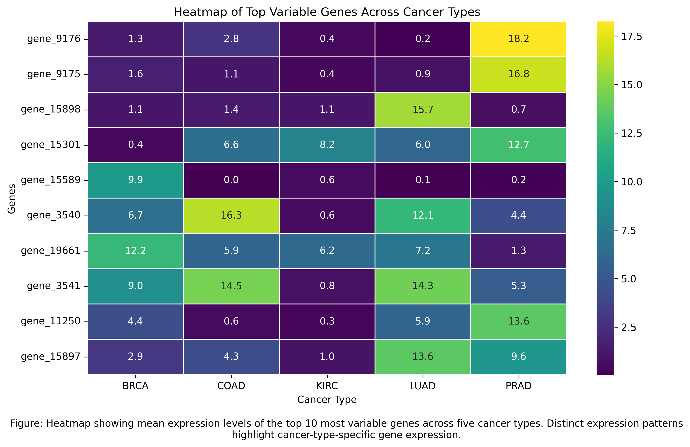

#### RNA-seq Gene Expression Variability Analysis Across Cancer Types

##### Project Overview
This project explores RNA-seq gene expression data across multiple cancer types to identify highly variable genes and investigate differences in expression patterns between cancer classes. The analysis focuses on understanding how gene expression varies across five cancer types and identifying genes that may show cancer-type-specific activity.
- Cancer types included in the study:
  - BRCA (Breast Cancer)
  - KIRC (Kidney Renal Clear Cell Carcinoma)
  - LUAD (Lung Adenocarcinoma)
  - PRAD (Prostate Adenocarcinoma)
  - COAD (Colon Adenocarcinoma)

- The workflow includes:
  - dataset preparation
  - cleaning
  - merging
  - exploratory analysis
  - variance-based gene selection and
  - visualization using heatmaps and clustering.

##### Dataset Description
The analysis uses two datasets:

1. RNA-seq Dataset:
Contains gene expression measurements of 20,530 genes (features)
801 patient samples (observations)

- Each row represents one sample and each column represents one gene(see data).

2. Label Dataset:
Contains sample/class identifiers
- Includes cancer-type classification for each sample

##### Project Workflow

Step 1: Data Loading
The RNA-seq dataset and label dataset are loaded using pandas and prepared for merging.

Step 2: Data Cleaning
- Renamed unnamed identifier columns
- Ensured consistent formatting
- Verified dataset dimensions
- Removed unnecessary columns where required
  
Step 3: Dataset Merging
The gene expression dataset and class labels were merged using the shared sample identifier column.

Step 4: Feature and Label Separation
- Features (X): gene expression values
- Labels (y): cancer-type classification
- This structure enables downstream statistical analysis.

Step 5: Exploratory Data Analysis
Performed initial exploration of class distribution:

- Key outcome: Analysis of the class distribution reveals that the samples are unevenly distributed across cancer types, with BRCA having the highest number of samples (300), while COAD has the fewest (78). This class imbalance may influence downstream analysis, particularly when comparing gene expression patterns across cancer types

Step 6: Gene Variability Analysis
Variance was used as the primary metric to identify 10 highly variable genes across samples.

Process:
- Compute variance for each gene
- Sort genes by variance
- Select top 10 most variable genes
  
|Top 10 genes| Variance|
|------------|---------|
|gene_9176   | 44.76   |
|gene_9175   | 36.36   |
|gene_15898  | 34.50   |
|gene_15301  | 33.46   |
|gene_15589  | 31.33   |
|gene_3540   | 30.59   |
|gene_1966   | 30.08   |
|gene_3541   | 28.72   |
|gene_1125   | 26.52   |
|gene_1589   | 26.02   |

These genes are strong candidates for distinguishing cancer-specific expression behavior.

Step 7: Differential Expression Analysis
Mean expression levels of top variable genes were computed across cancer classes to observe class-specific expression patterns.
Key outcome: Identification of genes with distinct expression signatures across cancer types.

Step 8: Heatmap Visualization
Heatmaps were generated to visualize:
- Expression differences across cancer types
- Relative gene activity patterns

The heatmap reveals clear differences in gene expression patterns across cancer types. For example:

  - PRAD shows strong expression of gene_9176 and gene_9175
  - LUAD is characterized by elevated gene_15898 expression
  - COAD and LUAD share expression patterns in gene_3540 and gene_3541
- These patterns highlight both cancer-specific and shared gene expression profiles.

Step 9: Cluster Map Visualization
Cluster maps were used to:
- Group genes with similar expression profiles
- Reveal hidden structure in expression patterns

  
- The cluster-based heatmap reveals structured patterns in gene expression across cancer types, suggesting the presence of groups of genes with similar expression behavior. These patterns highlight the possibility of functionally related gene groups, where genes may be co-expressed or co-activated under similar biological conditions

- Technologies Used for this analysis:
  - Python
  - Google Colab
  - Pandas
  - NumPy
  - Matplotlib
  - Seaborn
  
##### Key Results
- Identified top high-variance genes across samples
- Observed cancer-type-specific expression patterns
- Visualized expression differences using heatmaps
- Clustered genes with similar expression behavior

These findings highlight genes that may serve as potential biomarkers for distinguishing cancer types.

##### Future Improvements
Possible extensions of this project:
Apply dimensionality reduction (PCA / t-SNE)
Perform classification using machine learning models
Conduct pathway enrichment analysis

#####  Constriant
Due to anonymized gene identifiers, functional biological interpretation is limited; however, observed expression patterns remain valuable for identifying candidate features associated with cancer types.

##### Author
Ebere Jennifer Agbarakwe
MSc. Biomedical Sciences, BSc. Microbiology
Currently WBS GRUPPE student (Data Science with Python Cert.)

##### Data Source
- https://www.kaggle.com/datasets/waalbannyantudre/gene-expression-cancer-rna-seq-donated-on-682016?resource=download

